# Ardour Codebase Bible

This document is a reverse-engineering map of this Ardour checkout for someone who wants to understand the codebase deeply enough to design a professional Linux DAW. It is grounded in runtime entry points, class relationships, Waf build targets, and traced call paths. It does not treat filenames as proof by themselves; each major conclusion is tied to the files that implement or wire the behavior.

Important scope note: this repository includes Ardour code, UI code, build tooling, and many vendored libraries. The architecture conclusions below are based on traced Ardour execution paths and module ownership, not a line-by-line semantic proof of every vendored dependency.

## 1. High-Level Architecture

Ardour is organized as a native C++ desktop DAW with a GTK-derived GUI, a real-time audio/MIDI engine, a persistent session model, a route/processor graph for mixing, and separate utility/headless programs.

Primary runtime entry points:

- GUI application: `gtk2_ardour/main.cc`
- GUI coordinator: `gtk2_ardour/ardour_ui.h`, `gtk2_ardour/ardour_ui.cc`, `gtk2_ardour/ardour_ui_session.cc`
- Core audio/MIDI engine singleton: `libs/ardour/ardour/audioengine.h`, `libs/ardour/audioengine.cc`
- Session model root: `libs/ardour/ardour/session.h`, `libs/ardour/session.cc`
- Real-time process path: `libs/ardour/session_process.cc`, `libs/ardour/graph.cc`, `libs/ardour/route.cc`
- Timeline/editor UI: `gtk2_ardour/editor.h`, `gtk2_ardour/editor.cc`, `gtk2_ardour/route_time_axis.h`, `gtk2_ardour/audio_time_axis.h`, `gtk2_ardour/midi_time_axis.h`
- Mixer UI: `gtk2_ardour/mixer_ui.h`, `gtk2_ardour/mixer_ui.cc`, `gtk2_ardour/mixer_strip.h`, `gtk2_ardour/processor_box.h`
- Headless/session utilities: `headless/load_session.cc`, `session_utils/common.cc`, `session_utils/export.cc`, `luasession/luasession.cc`

Major subsystems:

| Subsystem | Responsibility | Main files |
|---|---|---|
| Application shell | Process startup, localization, config, GUI loop, shutdown | `gtk2_ardour/main.cc`, `gtk2_ardour/ardour_ui.cc` |
| Audio backend abstraction | JACK/ALSA/PulseAudio/CoreAudio/PortAudio backend control, callback bridge, port lifecycle | `libs/ardour/audioengine.cc`, `libs/ardour/ardour/audio_backend.h`, `libs/backends/*` |
| Port management | Audio/MIDI ports, cycle start/end, buffering, monitor checks | `libs/ardour/port_manager.cc`, `libs/ardour/port.cc`, `libs/ardour/audio_port.cc`, `libs/ardour/midi_port.cc` |
| Session | Project root: routes, sources, playlists, locations, transport, XML state, history, export, Lua | `libs/ardour/session*.cc`, `libs/ardour/ardour/session.h` |
| Route graph | Dependency-sorted route execution, optional parallel worker graph | `libs/ardour/graph.cc`, `libs/ardour/graphnode.cc`, `libs/ardour/graph_edges.cc` |
| Tracks/routes | Signal path, processors, disk I/O, monitoring, mute/solo, automation | `libs/ardour/route.cc`, `libs/ardour/track.cc`, `libs/ardour/audio_track.cc`, `libs/ardour/midi_track.cc` |
| Disk streaming | Non-real-time refill/flush, read/write ring buffers, capture sources | `libs/ardour/butler.cc`, `libs/ardour/disk_reader.cc`, `libs/ardour/disk_writer.cc`, `libs/ardour/disk_io.cc` |
| Timeline data | Regions, playlists, sources, tempo map, locations/markers | `libs/ardour/region.cc`, `libs/ardour/playlist.cc`, `libs/ardour/source.cc`, `libs/temporal/tempo.cc`, `libs/ardour/location.cc` |
| MIDI model | Structured note/controller model over SMF/event storage | `libs/ardour/midi_model.cc`, `libs/ardour/midi_source.cc`, `libs/ardour/smf_source.cc`, `libs/evoral/*` |
| Plugins | Plugin discovery, cache, abstraction, inserts, UI hosting | `libs/ardour/plugin_manager.cc`, `libs/ardour/plugin.cc`, `libs/ardour/plugin_insert.cc`, `libs/ardour/lv2_plugin.cc`, `libs/ardour/vst3_plugin.cc` |
| Export/render | Offline graph, format/profile management, session export path | `libs/ardour/session_export.cc`, `libs/ardour/export_handler.cc`, `libs/ardour/export_graph_builder.cc`, `gtk2_ardour/export_dialog.cc` |
| GUI | GTK/YTK widgets, editor, mixer, dialogs, canvas, bindings | `gtk2_ardour/*`, `libs/canvas/*`, `libs/widgets/*`, `libs/gtkmm2ext/*` |
| Build/package | Waf configuration, generated headers/scripts, bundle packaging | `wscript`, `gtk2_ardour/wscript`, `libs/*/wscript`, `tools/linux_packaging/*` |

Dependency graph:

```mermaid
graph TD
  main[gtk2_ardour/main.cc] --> ui[ARDOUR_UI]
  ui --> editor[Editor/PublicEditor]
  ui --> mixer[Mixer_UI]
  ui --> engine[AudioEngine]
  ui --> session[Session]
  engine --> backend[AudioBackend implementations]
  engine --> portmgr[PortManager/Ports]
  engine --> session
  session --> graph[Graph/GraphChain]
  session --> routes[RouteList]
  session --> butler[Butler]
  session --> tempo[Temporal::TempoMap]
  session --> locations[Locations]
  session --> sources[Source/AudioSource/MidiSource]
  routes --> processors[Processor chain]
  routes --> diskreader[DiskReader]
  routes --> diskwriter[DiskWriter]
  processors --> plugins[PluginInsert/Plugin]
  plugins --> pluginmgr[PluginManager]
  editor --> timeline[TimeAxisView/RegionView/Canvas]
  mixer --> strips[MixerStrip/ProcessorBox]
```

Startup sequence:

1. `gtk2_ardour/main.cc` performs environment setup: old config checks, `curl_global_init`, bundle environment, fonts, localization, signal handlers, command-line parsing, and debug flags.
2. `main()` calls `ARDOUR::init(...)`, which initializes core libardour global state.
3. `main()` calls `setup_gtk_ardour_enums()` and `UIConfiguration::instance().pre_gui_init()`.
4. `main()` constructs `ARDOUR_UI`.
5. `ARDOUR_UI` creates and wires the GUI, startup FSM, engine dialogs, actions, editor/mixer dependents, and session loading/building paths.
6. A session is created or loaded by `ARDOUR_UI::load_session()` / `ARDOUR_UI::build_session()` in `gtk2_ardour/ardour_ui_session.cc`, which creates `Session`.
7. `Session::Session` in `libs/ardour/session.cc` initializes playlists, butler, transport FSM, locations, Lua, sources, routes, VCAs, selection, loads XML state, then runs post-engine initialization.
8. The backend eventually calls `AudioEngine::process_callback()`, which drives real-time session processing.

Thread model:

| Thread | Role | Evidence |
|---|---|---|
| GUI/main thread | GTK/YTK event loop, menus, editor/mixer widgets, most user commands | `gtk2_ardour/main.cc`, `Gtkmm2ext::UI`, `gui_context()` usage |
| Backend process thread | Real-time audio/MIDI callback | `AudioEngine::process_callback()` in `libs/ardour/audioengine.cc` |
| Graph worker threads | Parallel route processing where graph mode is active | `libs/ardour/graph.cc`, `AudioEngine::create_process_thread()` |
| Butler thread | Non-real-time disk refill/flush and transport work | `libs/ardour/butler.cc` |
| Hardware event threads | Backend reset/device list update | `AudioEngine::start_hw_event_processing()` in `libs/ardour/audioengine.cc` |
| Scanner/helper processes | Plugin scanning outside main process for VST/AU/VST3 | `libs/ardour/plugin_manager.cc`, `libs/fst/wscript`, `libs/auscan/wscript` |

## 2. Audio Engine

Audio callback lifecycle:

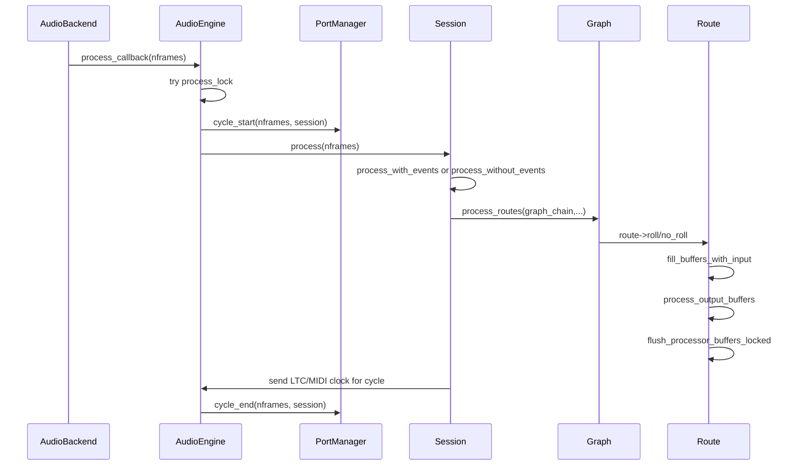

Key files:

- `libs/ardour/ardour/audioengine.h`: backend proxy API and callback surface.
- `libs/ardour/audioengine.cc`: process callback, buffer-size/sample-rate change callbacks, latency measurement, session removal fadeout.
- `libs/ardour/session_process.cc`: real-time session process logic.
- `libs/ardour/graph.cc`: graph fan-out and worker coordination.
- `libs/ardour/route.cc`: per-route DSP chain.
- `libs/ardour/processor.cc`, `libs/ardour/plugin_insert.cc`, `libs/ardour/delivery.cc`, `libs/ardour/amp.cc`: processor implementations.

Buffer management:

- `AudioEngine::buffer_size_change()` calls `set_port_buffer_sizes()` and `Session::set_block_size()`.
- `Session::process()` obtains per-thread buffers through `_engine.main_thread()->get_buffers()` and releases them with `drop_buffers()`.
- `Route::run_route()` gets route scratch buffers via `_session.get_route_buffers(n_process_buffers())`.
- `BufferSet` and typed buffers live under `libs/ardour/ardour/buffer_set.h`, `libs/ardour/buffer_set.cc`, `audio_buffer.*`, `midi_buffer.*`.
- Ports call `PortManager::cycle_start`, `PortManager::cycle_end`, `Port::set_varispeed_ratio`, and split-cycle handling through `AudioEngine::split_cycle()`.

Latency compensation:

- `Route::process_output_buffers()` explicitly offsets automation and timeline positions by `_signal_latency`, `_output_latency`, and processor `effective_latency()`.
- Session-level worst-case latency lives in `Session` members `_worst_output_latency`, `_worst_input_latency`, `_worst_route_latency`, `_remaining_latency_preroll`.
- `AudioEngine::process_callback()` handles queued playback/capture latency callbacks and calls `Session::update_latency()`.
- Latency measurement uses `MTDM` and `MIDIDM` through `AudioEngine::prepare_for_latency_measurement()`, `start_latency_detection()`, and the measurement branch in `process_callback()`.

Sample rate handling:

- Backend sample-rate changes call `AudioEngine::sample_rate_change()`.
- If a session exists, it calls `Session::set_sample_rate`; otherwise it updates `Temporal::set_sample_rate`.
- `Session` stores `_base_sample_rate`, `_current_sample_rate`, and uses `nominal_sample_rate()`.
- Resampling and varispeed dependencies include `libs/zita-resampler`, Rubber Band, and SRC-related code such as `libs/ardour/srcfilesource.cc`.

Real-time constraints:

- `AudioEngine::process_callback()` uses `PBD::Mutex::TryLock`; on lock failure it emits xrun and silences output instead of blocking.
- Route processor changes are RCU/lock-aware: `Route::process_output_buffers()` uses a try reader lock on `_processor_lock`.
- Disk I/O is split: the callback consumes prefilled buffers, and the `Butler` handles refill/flush outside the real-time path.
- Session events use per-thread pools and ring buffers; `AudioEngine::process_callback()` initializes thread-local process state when needed.
- Real-time code avoids waiting for non-real-time work. `Session::process()` checks `non_realtime_work_pending()` and coordinates with `Butler`.

DSP pipeline:

Inside `Route::run_route()`:

1. Fill scratch buffers from route input ports.
2. Filter input; MIDI tracks override `filter_input()`.
3. Apply monitor gain logic for monitor route.
4. Snapshot and write out-of-band MIDI data.
5. Run `process_output_buffers()`.
6. Update controls from buffers.
7. Flush processor buffers to ports.

Inside `Route::process_output_buffers()`:

1. Run route/panner/amp automation.
2. Offset playback by latency.
3. Decide disk reader/writer participation.
4. Apply denormal protection.
5. Iterate `_processors`.
6. For each active processor, accumulate latency and call `Processor::run`.
7. Update `BufferSet` channel counts after each processor.

## 3. Session Model

`Session` is the project root. It owns or coordinates:

- Routes/tracks/buses: `routes` RCU list in `Session`.
- Playlists: `SessionPlaylists`.
- Sources: `SourceMap`, audio and MIDI sources.
- Locations/markers/ranges: `Locations`.
- Tempo state: `Temporal::TempoMap`.
- Transport FSM: `TransportFSM`.
- Disk I/O background worker: `Butler`.
- Plugin state and missing plugin resolution.
- Undo history: inherited `PBD::HistoryOwner`.
- Lua state and scripts.
- VCAs and mixer scenes.

Session construction is in `libs/ardour/session.cc`. The constructor:

1. Initializes core members and atomics.
2. Calls `Temporal::reset()`.
3. Calls `pre_engine_init(fullpath)`.
4. Initializes Lua.
5. Requires an already-running audio engine.
6. Loads misc port state.
7. Creates or loads session state.
8. Calls `post_engine_init()`.
9. Adds monitor sends if templates require it.
10. Stores recent session metadata.

Serialization:

- `Session::save_state()` in `libs/ardour/session_state.cc` writes XML to a temporary file, renames it into `.ardour` or `.pending`, saves undo history, clears dirty state, and saves misc port state.
- `Session::load_state()` reads `.pending` crash state first if present, otherwise `.ardour`, validates the XML root, parses session version, and may back up old-version sessions.
- `Session::state()` assembles the actual XML tree. It is the central serialization point for routes, sources, playlists, tempo, locations, metadata, config, and related objects.

Undo/redo:

- `Session` inherits `PBD::HistoryOwner`.
- Editor actions call `begin_reversible_command()` and `commit_reversible_command()` via `Editor` wrappers in `gtk2_ardour/editor_ops.cc`.
- Commands are typically `MementoCommand`, `StatefulDiffCommand`, `TempoCommand`, or MIDI `DiffCommand`.
- History persistence is in `Session::save_history()` and `Session::restore_history()`.
- MIDI editing has custom diff commands in `MidiModel`: `NoteDiffCommand`, `SysExDiffCommand`, `PatchChangeDiffCommand`.

Autosave:

- GUI timer setup: `ARDOUR_UI::update_autosave()` in `gtk2_ardour/ardour_ui.cc`.
- Timer callback: `ARDOUR_UI::autosave_session()` in `gtk2_ardour/ardour_ui_session.cc`.
- Core write: `Session::maybe_write_autosave()` writes pending state only if dirty and not recording.

## 4. Timeline

Timeline concepts:

| Concept | Model files | GUI files |
|---|---|---|
| Track | `track.h/.cc`, `audio_track.*`, `midi_track.*` | `route_time_axis.*`, `audio_time_axis.*`, `midi_time_axis.*` |
| Region | `region.*`, `audioregion.*`, `midi_region.*` | `region_view.*`, `audio_region_view.*`, `midi_region_view.*` |
| Playlist | `playlist.*`, `audio_playlist.*`, `midi_playlist.*` | `playlist_selector.*` |
| Source | `source.*`, `audiofilesource.*`, `sndfilesource.*`, `midi_source.*`, `smf_source.*` | source/region list UIs |
| Tempo map | `libs/temporal/tempo.*`, `libs/ardour/tempo.*` | `editor_tempodisplay.*`, `tempo_curve.*`, `tempo_map_change.*` |
| Markers/ranges | `location.*` | `marker.*`, `editor_markers.cc`, `location_ui.*` |
| Playhead/transport | `session_transport.cc`, `transport_fsm.*` | `transport_control_ui.*`, `main_clock.*` |
| Loop/punch | `location.*`, `session_transport.cc`, `session_process.cc` | editor marker/loop/punch actions |

Tracks are routes with disk I/O. `Track` extends `Route` and adds playlists, record enable/safe controls, freeze/bounce, and disk reader/writer coordination. Audio and MIDI tracks specialize it.

Regions are timeline references into sources. They do not own all audio/MIDI file data directly; they describe a span and transformation over source material. Playlists arrange regions per track.

Tempo is split into the `libs/temporal` library for time math and tempo map primitives, plus Ardour integration and GUI editing.

Loop handling appears in three places:

- Transport/session constraints in `session_transport.cc`.
- Real-time loop processing in `session_process.cc`.
- Disk reader loop declicking and preloop buffers in `disk_reader.cc`.

## 5. Mixer

Mixer model:

- A mixer channel is a `Route`.
- A recordable channel is a `Track`.
- A bus is a `Route` without track disk-stream semantics.
- The signal path is the route `_processors` list.
- Core route processors include trim, disk reader, amp, panner/delivery, meter, disk writer, sends, inserts, plugin inserts.

Signal flow:

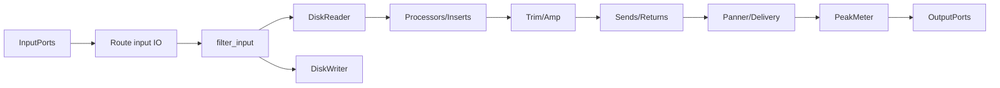

GUI mixer:

- `Mixer_UI` is the mixer tab/window container.
- `MixerStrip` represents a route strip.
- `ProcessorBox` displays/edit inserts and processors.
- `PluginSelector` feeds plugin selection.
- `MonitorSection`, `FoldbackStrip`, `VCAMasterStrip`, and `SurroundStrip` add specialized strip types.

Sends/inserts/buses:

- Sends are processors: `send.*`, `internal_send.*`, `return.*`.
- Hardware inserts/port inserts: `port_insert.*`, `io_processor.*`.
- Buses are `Route` instances.
- Master/monitor/foldback routes are special presentation/route flags and setup paths in session route code.

VCAs:

- Model: `vca.*`, `vca_manager.*`, `control_slave.*`, `slavable_automation_control.*`.
- UI: `vca_time_axis.*`, `vca_master_strip.*`.
- VCAs influence controllables such as gain/mute/solo through master/slave control relationships rather than audio signal summing.

Gain staging:

- Gain controls are automation-capable controls (`GainControl`, `AutomationControl`).
- `Amp` applies gain and gain automation.
- `Route::process_output_buffers()` offsets gain/trim automation by latency so fader automation aligns to audible output.

## 6. Plugin Architecture

Plugin layers:

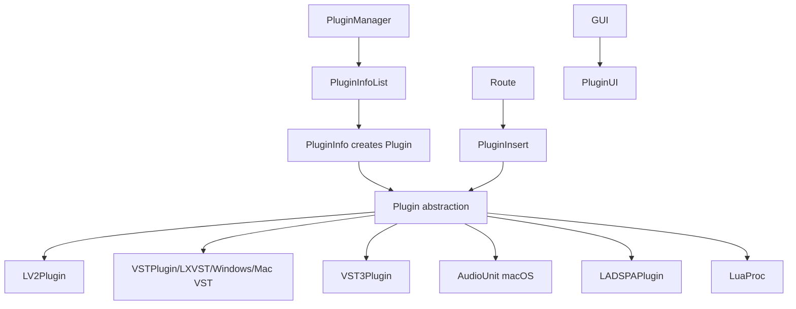

Entry files:

- Manager/cache/scanning: `libs/ardour/plugin_manager.cc`, `libs/ardour/ardour/plugin_manager.h`
- Abstract plugin API: `libs/ardour/plugin.cc`, `libs/ardour/ardour/plugin.h`
- Route processor wrapper: `libs/ardour/plugin_insert.cc`, `libs/ardour/ardour/plugin_insert.h`
- LV2: `libs/ardour/lv2_plugin.cc`, `libs/ardour/ardour/lv2_plugin.h`
- VST3: `libs/ardour/vst3_plugin.cc`, `libs/ardour/vst3_module.cc`, `libs/ardour/vst3_host.cc`
- VST2 support/scanners: `libs/fst/*`, `libs/ardour/vst2_scan.cc`, `libs/ardour/lxvst_plugin.cc`
- AU: `libs/ardour/audio_unit.cc`, `libs/auscan/au-scanner.cc`
- UI: `gtk2_ardour/plugin_ui.*`, `lv2_plugin_ui.*`, `vst_plugin_ui.*`, `vst3_plugin_ui.*`

Hosting model:

- `Plugin` abstracts parameters, presets, latency, tail time, state, I/O ports, activation, block size, and `connect_and_run()`.
- `PluginInsert` is a `Processor` and owns one or more `Plugin` instances, channel maps, sidechains, automation controls, and bypass/thru behavior.
- Scanning is partly externalized to scanner binaries to reduce crash impact. That is not full plugin sandboxing for live processing; live plugin code still runs in the process unless the specific plugin technology wrapper provides isolation.

Parameter automation:

- Plugin parameters are represented as `Evoral::Parameter`.
- `PluginInsert::automation_run()` drives controls.
- `Automatable` and `AutomationControl` manage automation lists and write/read/touch/latch behavior.
- GUI automation lanes are `AutomationTimeAxisView`, `AutomationLine`, and MIDI/plugin-specific wrappers.

## 7. MIDI Engine

MIDI runtime layers:

- Low-level ports/buffers: `midi_port.*`, `midi_buffer.*`, `rt_midibuffer.*`.
- Event/model library: `libs/evoral/*`.
- Source storage: `midi_source.*`, `smf_source.*`.
- Structured editing model: `midi_model.*`.
- Track integration: `midi_track.*`, `midi_playlist.*`, `midi_region.*`.
- GUI editing: `midi_view.*`, `midi_region_view.*`, `midi_time_axis.*`, `pianoroll.*`, `piano_roll_header.*`.

MIDI routing:

- MIDI ports are managed by `AudioEngine`/`PortManager`.
- MIDI tracks are `Track` subclasses with MIDI buffers, channel filters, immediate event buffers, step edit ring buffers, and MIDI-specific controls.
- Plugin MIDI flows through `PluginInsert` and plugin-specific I/O maps.

Event storage:

- `MidiBuffer` is block/callback-level storage.
- `MidiModel` stores notes, sysex, patch changes, and controller automation at musical beat time.
- `SMFSource` stores MIDI data on disk using Standard MIDI File support.

Recording pipeline:

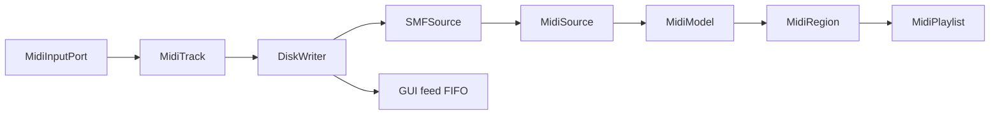

Quantization/editing:

- MIDI editing commands are mostly in `gtk2_ardour/midi_view.cc`, `pianoroll.cc`, and operator classes under `libs/ardour/midi_operator.*`.
- Quantize UI is `gtk2_ardour/quantize_dialog.*`.
- Edits are applied as `MidiModel::DiffCommand` instances so undo/redo can reverse note-level changes.

## 8. Recording Engine

Recording is a collaboration between `Session`, `Track`, `DiskWriter`, `Butler`, and `Source` objects.

Key files:

- Transport record state: `libs/ardour/session_transport.cc`
- Track record controls: `libs/ardour/track.cc`
- Disk writing: `libs/ardour/disk_writer.cc`
- Disk streaming base: `libs/ardour/disk_io.cc`
- Audio files: `audiofilesource.*`, `sndfilesource.*`, `source_factory.*`
- Peak generation: `peakfile.*`, `audiofilesource.*`, waveform views under `libs/waveview`

Pipeline:

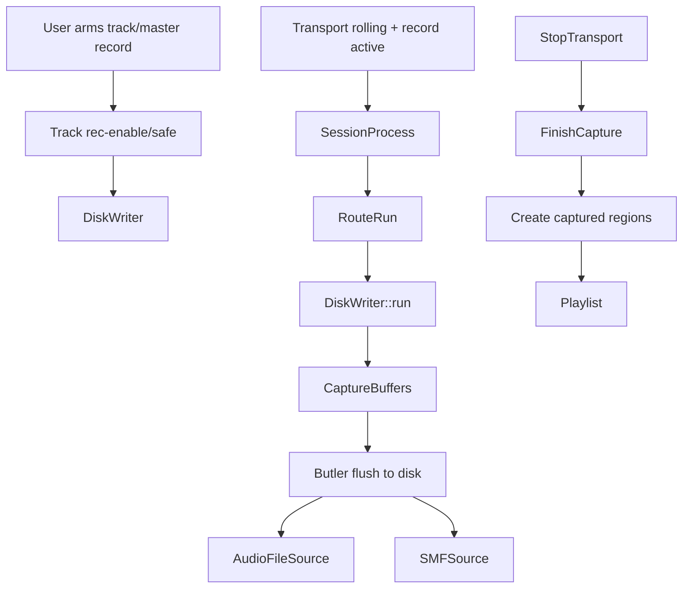

Punch in/out and overdub are controlled by session transport constraints and record range calculation. `DiskWriter::calculate_record_range()` determines the recordable slice for a callback cycle. MIDI overdub behavior appears in MIDI track/source code and record mode handling in `track.cc`.

## 9. Rendering / Export Pipeline

Export entry points:

- GUI dialog: `gtk2_ardour/export_dialog.cc`
- Simple/session utility export: `session_utils/export.cc`
- Core export orchestration: `libs/ardour/session_export.cc`
- Export manager: `libs/ardour/export_handler.cc`
- Export graph: `libs/ardour/export_graph_builder.cc`
- Formats/presets/filenames/timespans: `export_format_*`, `export_profile_manager.*`, `export_filename.*`, `export_timespan.*`
- Audio file writing/conversion: `libs/audiographer/*`

Export flow:

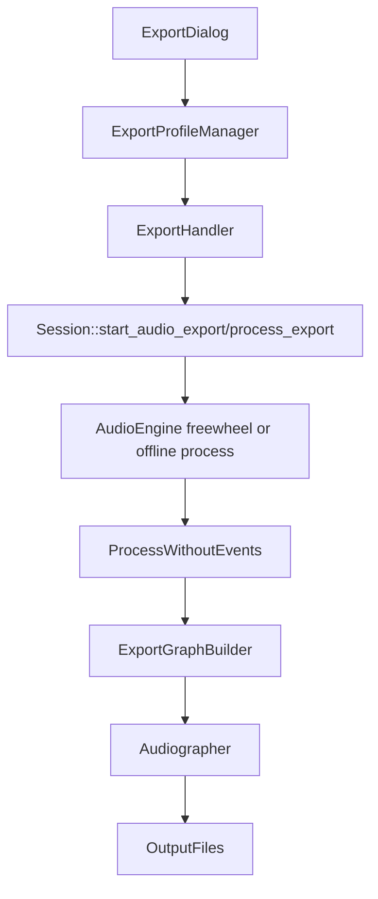

`Session::process_export()` and `Session::process_export_fw()` reuse the normal route processing path with export-specific transport, freewheel, and graph output behavior.

## 10. GUI

Toolkit:

- Ardour uses a GTK2-derived stack: `ytkmm`, `ydkmm`, `gtkmm2ext`, and custom Ardour widgets.
- Canvas rendering lives in `libs/canvas`.
- Common widgets live in `libs/widgets`.

GUI architecture:

- `ARDOUR_UI` is the application shell and session-aware coordinator.
- `Editor` is the timeline controller/view.
- `Mixer_UI` is the mixer controller/view.
- `PublicEditor` is the interface used by other UI code to avoid depending on all of `Editor`.
- `RouteUI`, `RouteTimeAxisView`, `MixerStrip`, and `ProcessorBox` are UI adapters over core `Route`/`Processor` objects.

Pattern:

It is not pure MVC or MVVM. It is a signal-driven C++ desktop architecture:

- Model: `libs/ardour` classes.
- View/controller: `gtk2_ardour` classes.
- Signals: `PBD::Signal`, `sigc++`, GTK signals.
- State bridge: `SessionHandlePtr` and object-specific signal connections.
- Commands/undo: GUI initiates reversible commands against session/model state.

UI event flow:

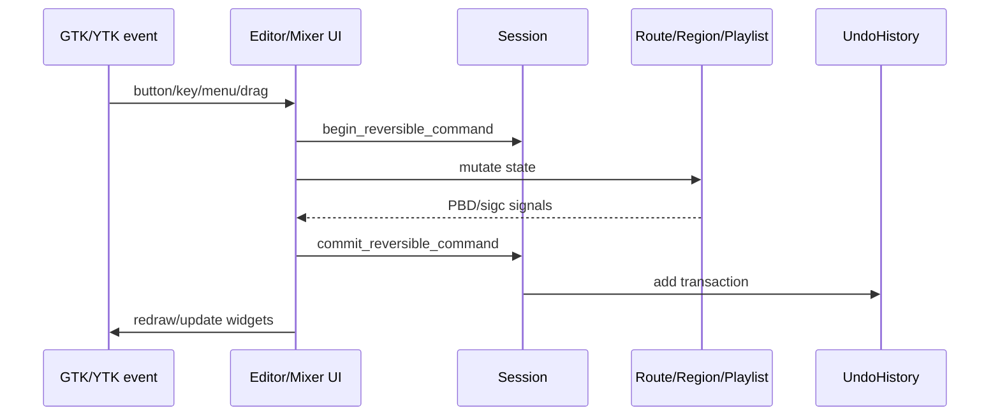

Rendering:

- Timeline drawing is mostly canvas item based.
- Waveform rendering is separated into waveview/peak infrastructure.
- Mixer strips are GTK widget trees with custom meters/buttons.

## 11. Top-Level File Layout

| Path | Purpose |
|---|---|
| `wscript` | Top-level Waf configuration/build orchestration. |
| `gtk2_ardour/` | Main GUI application: editor, mixer, dialogs, plugin UI, transport, canvas integration. |
| `libs/ardour/` | Core DAW engine and model: session, routes, tracks, processors, plugins, disk I/O, transport, export. |
| `libs/backends/` | Audio backend implementations and backend build glue. |
| `libs/pbd/` | Platform/base utilities: signals, XML, undo, threading, filesystem, debug, state. |
| `libs/temporal/` | Time, beats, tempo map, superclock, musical-time infrastructure. |
| `libs/evoral/` | Event/automation/MIDI sequence primitives. |
| `libs/midi++2/` | MIDI parsing/ports/protocol utilities. |
| `libs/audiographer/` | Export/audio file processing pipeline. |
| `libs/canvas/` | Custom canvas rendering layer used by the editor. |
| `libs/widgets/` | Ardour-specific GTK widgets. |
| `libs/gtkmm2ext/` | GTKmm extensions, bindings, UI helpers. |
| `libs/fst/`, `libs/vst3/`, `libs/auscan/` | VST/AU scanner/SDK/hosting support. |
| `libs/surfaces/` | Control surface integrations. |
| `libs/panners/` | Panner plugins/logic. |
| `libs/plugins/`, `libs/vamp-*`, `libs/qm-dsp/` | Built-in analysis/plugins/DSP support. |
| `libs/zita-*`, `libs/fluidsynth`, `libs/hidapi`, `libs/libltc`, `libs/aaf`, `libs/ptformat` | Vendored or bundled support libraries. |
| `headless/` | Headless Ardour executable. |
| `session_utils/` | Command-line utilities for session operations/export. |
| `luasession/` | Lua session runner. |
| `share/` | Runtime resources: templates, scripts, patch files, RDF, MIDI maps, export presets. |
| `tools/` | Packaging, maintenance, update scripts, test helpers. |
| `doc/` | Existing upstream-oriented documentation and Doxygen support. |
| `docs/` | This reverse-engineering guide. |

## 12. Important Classes

Core:

- `AudioEngine`: singleton bridge from backend callback to session processing.
- `AudioBackend`: backend interface implemented by JACK/ALSA/PulseAudio/etc.
- `PortManager`, `Port`, `AudioPort`, `MidiPort`: port lifecycle and callback buffers.
- `Session`: project root, transport owner, route/source/playlists/locations/export/history coordinator.
- `TransportFSM`: transport state machine.
- `Graph`, `GraphChain`, `GraphNode`: dependency-sorted route processing.
- `Route`: mixer channel/signal path.
- `Track`: route with playlist and disk I/O.
- `AudioTrack`, `MidiTrack`: typed track specializations.
- `Processor`: base class for signal path elements.
- `Amp`, `Delivery`, `PeakMeter`, `Send`, `Return`, `PortInsert`, `PluginInsert`: processor types.
- `Plugin`, `PluginManager`, `PluginInfo`: plugin abstraction/discovery.
- `DiskReader`, `DiskWriter`, `Butler`: disk streaming.
- `Source`, `AudioSource`, `AudioFileSource`, `SndFileSource`, `MidiSource`, `SMFSource`: media storage.
- `Region`, `AudioRegion`, `MidiRegion`: timeline media references.
- `Playlist`, `AudioPlaylist`, `MidiPlaylist`: region arrangement.
- `Location`, `Locations`: markers, loop/punch/session ranges.
- `TempoMap`, `Tempo`, `Meter`: musical time model.
- `AutomationControl`, `AutomationList`, `Automatable`: automation.
- `MidiModel`: structured note/controller editing model.
- `VCAManager`, `VCA`: VCA control.

GUI:

- `ARDOUR_UI`: app shell.
- `StartupFSM`, `SessionDialog`, `EngineControl`: startup/session/engine flow.
- `Editor`, `PublicEditor`, `EditingContext`: timeline editing.
- `TimeAxisView`, `RouteTimeAxisView`, `AudioTimeAxisView`, `MidiTimeAxisView`: track lanes.
- `RegionView`, `AudioRegionView`, `MidiRegionView`: region drawing/editing.
- `MidiView`, `Pianoroll`, `PianorollWindow`: MIDI editing.
- `Mixer_UI`, `MixerStrip`, `ProcessorBox`, `RouteUI`: mixer and channel-strip UI.
- `PluginUIWindow`, `GenericPluginUI`, `LV2PluginUI`, `VST3PluginUI`: plugin UIs.

## 13. Build System

Ardour uses Waf.

Top-level `wscript` responsibilities:

- Parse options such as `--with-backends`, `--freedesktop`, `--no-vst3`, `--no-lxvst`, `--use-external-libs`.
- Detect platform/compiler/features.
- Set version/revision.
- Configure dependencies using pkg-config and custom checks.
- Recurse into libraries and application directories.
- Install shared data, config, templates, RDF, scripts.

Important build targets:

- GUI app target in `gtk2_ardour/wscript`: `ardour-${VERSION}` and launcher script `ardour${MAJOR}`.
- Core library in `libs/ardour/wscript`: target `ardour`.
- Headless app: `headless/wscript`.
- Session utilities: `session_utils/wscript`.
- Lua session utility: `luasession/wscript`.
- Plugin scanners: `libs/fst/wscript`, `libs/auscan/wscript`.

Generated files include config headers, version headers, resource substitutions, desktop/appdata files, keybindings, localization catalogs, and launch scripts.

## 14. Third-Party Libraries

Major dependency purposes:

- GTK/YTK/gtkmm stack: desktop UI.
- GLib/GIO/GObject: platform utilities, main loop, filesystem, modules.
- Boost: C++ utility containers/features.
- libsndfile: audio file read/write.
- libsamplerate/zita-resampler/Rubber Band: resampling, time stretch/pitch shift.
- FFTW: FFT analysis/DSP.
- LV2/lilv/serd/sord/sratom: LV2 plugin hosting.
- LRDF: LADSPA/RDF metadata.
- liblo: OSC.
- libusb/hidapi/cwiid/bluez: controller/control-surface/hardware integration.
- libcurl: network access for metadata/announcements/SoundCloud paths.
- libarchive: archive/session packaging support.
- taglib: audio metadata tags.
- Vamp SDK/qm-dsp: analysis plugins.
- libltc: linear timecode.
- Lua/LuaBridge: scripting.
- VST3 SDK: VST3 hosting.
- Fluidsynth: synth support.

## 15. Data Flow Diagrams

Audio flow:

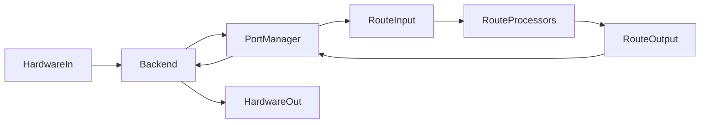

MIDI flow:

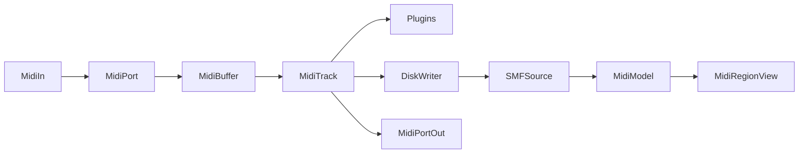

Session loading:

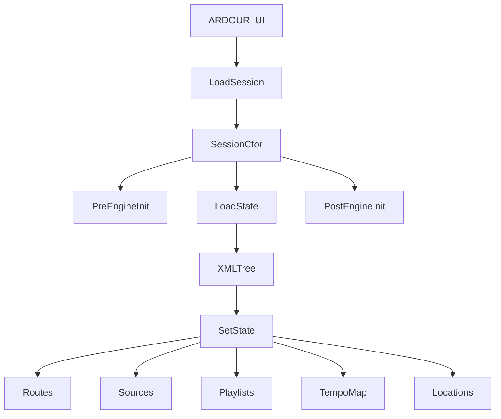

Playback:

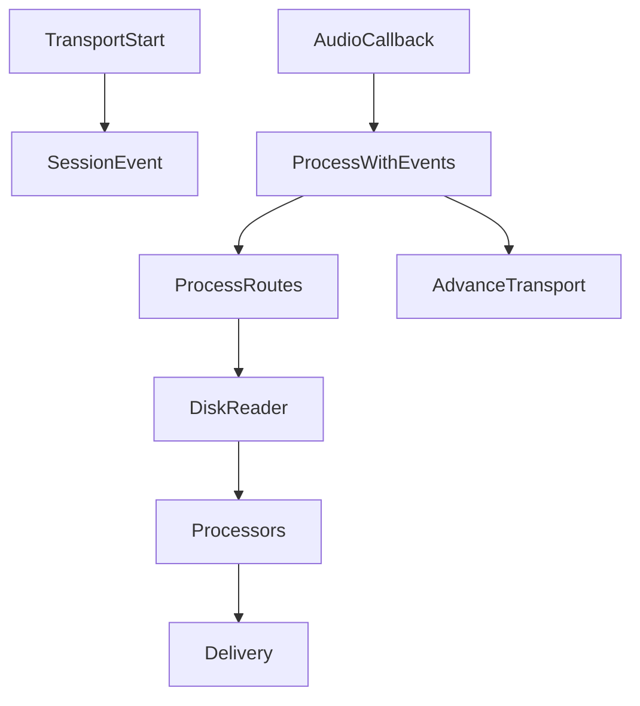

Recording:

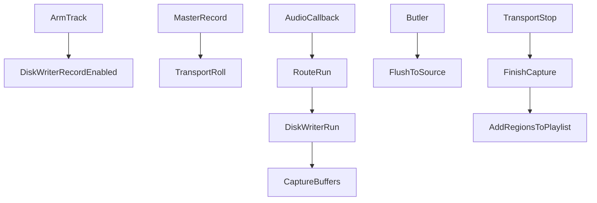

UI events:

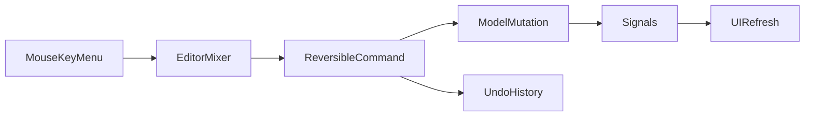

## 16. Performance / Real-Time Safety

Key strategies:

- Try-lock in the audio callback; silence and report xrun instead of blocking.
- Disk I/O is moved to `Butler`.
- Route/processor lists are protected by RCU/RW locks and real-time-safe pending changes.
- Process graph can run routes in worker threads.
- Per-thread process buffers avoid repeated allocation.
- MIDI and session events use ring buffers/event queues.
- Latency preroll aligns playback/capture around latent routes/plugins.
- Denormal protection prevents CPU spikes on tiny floating-point values.
- Plugin scanning is separated from the main process where possible.

Risk areas:

- Live plugin processing still executes third-party code in the audio process path.
- Large legacy GUI classes can perform broad operations and are difficult to reason about.
- Some callback branches still coordinate complex state changes, especially latency updates and session removal.

## 17. Technical Debt / Redesign Candidates

Observed architectural debt:

- Very large classes: `Session`, `Route`, `Editor`, `ARDOUR_UI`, and `Mixer_UI` carry many responsibilities.
- GUI and model are signal-decoupled but not cleanly separated into strict MVC/MVVM.
- GTK2/YTK stack is old and custom, which raises maintenance cost.
- Plugin hosting mixes multiple standards and platform-specific code in long-lived abstractions.
- Session XML is powerful but broad; schema/version migration complexity is high.
- Real-time route mutation is correct but intricate due to legacy dynamic routing requirements.
- Build system is mature but custom; onboarding is harder than with modern CMake/Meson/Cargo-style graphs.
- Full plugin sandboxing is not central to live processing.

What still works well:

- Clear separation between real-time callback and non-real-time disk work.
- Route/processor abstraction is durable.
- Session XML makes projects inspectable and portable.
- Undo command model is flexible.
- Temporal library isolates musical time concerns better than embedding tempo math everywhere.

## 18. Learning Roadmap

Study in this order:

1. `README`, `wscript`, `gtk2_ardour/wscript`, `libs/ardour/wscript`: understand build targets.
2. `gtk2_ardour/main.cc`: process startup.
3. `gtk2_ardour/ardour_ui.h/.cc` and `ardour_ui_session.cc`: GUI/session orchestration.
4. `libs/ardour/ardour/audioengine.h`, `libs/ardour/audioengine.cc`: callback bridge.
5. `libs/ardour/session.cc`, `libs/ardour/session_process.cc`: session lifecycle and process callback.
6. `libs/ardour/graph.cc`: route execution graph.
7. `libs/ardour/route.h/.cc`, `processor.h/.cc`: mixer signal chain.
8. `track.h/.cc`, `audio_track.*`, `midi_track.*`: track specialization.
9. `disk_reader.*`, `disk_writer.*`, `butler.*`: disk streaming and recording.
10. `region.*`, `playlist.*`, `source.*`: timeline model.
11. `libs/temporal/tempo.*`: tempo map.
12. `midi_model.*`, `midi_source.*`, `smf_source.*`, `libs/evoral/*`: MIDI.
13. `plugin_manager.*`, `plugin.*`, `plugin_insert.*`, then LV2/VST3 files.
14. `session_state.cc`: serialization and history.
15. `session_export.cc`, `export_handler.cc`, `export_graph_builder.cc`: export.
16. `gtk2_ardour/editor.h/.cc`, then `route_time_axis`, `region_view`, `midi_view`.
17. `gtk2_ardour/mixer_ui.*`, `mixer_strip.*`, `processor_box.*`.
18. Control surfaces, Lua, video, and import/export formats.

## 19. Building A Modern DAW Inspired By Ardour

Keep:

- Route/processor graph as the core abstraction.
- Strict split between real-time audio callback and non-real-time disk/work queues.
- Explicit session model with inspectable project files.
- Command-based undo/redo.
- Latency-aware processing and preroll.
- Typed audio/MIDI buffers and sample-accurate automation.

Redesign:

- Use a smaller core: `Engine`, `Project`, `Timeline`, `MixerGraph`, `MediaStore`, `PluginHost`, `CommandLog`.
- Use a modern UI toolkit with retained state and explicit data binding.
- Make the audio graph immutable per callback epoch: edits build a new graph snapshot, callback atomically swaps.
- Run plugins out-of-process by default with shared-memory audio/MIDI transport, and allow trusted in-process mode only when requested.
- Store projects in a versioned schema such as SQLite plus media folders, or a normalized document format with migrations.
- Separate arrangement timeline and clip launcher/session view from the beginning.
- Make automation a first-class lane model independent of track UI.
- Use a declarative routing graph with validation before activation.
- Build with a modern dependency graph and reproducible package scripts.

Proposed clean architecture:

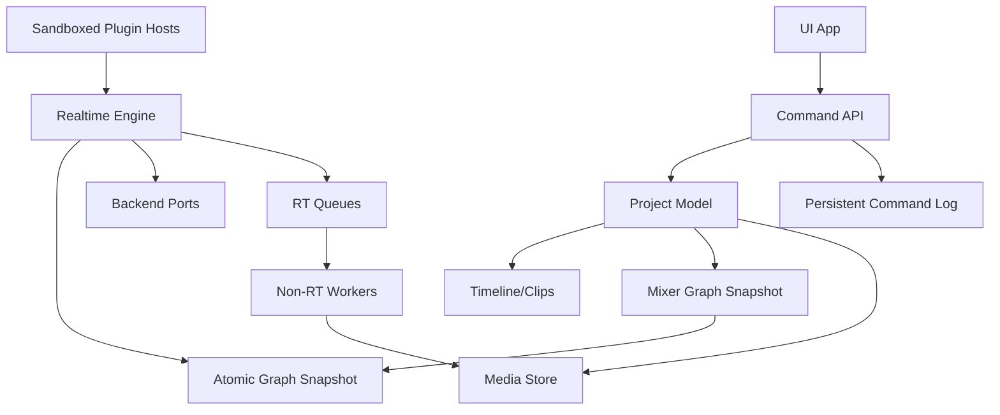

For your workflow as recording artist, producer, mixing engineer, and software engineer, prioritize:

- Fast session startup.
- Zero-friction recording paths.
- Strong comping/take management.
- First-class vocal chain templates.
- Low-latency monitoring graph.
- Bounce/freeze/commit workflow.
- Scriptable project automation.
- Plugin crash isolation.
- Keyboard-driven editing and mixing.

## 20. Entry-Point Index

Use these files as anchors:

- Startup: `gtk2_ardour/main.cc`
- App shell: `gtk2_ardour/ardour_ui.cc`
- Session load/build: `gtk2_ardour/ardour_ui_session.cc`
- Engine callback: `libs/ardour/audioengine.cc`
- Session process: `libs/ardour/session_process.cc`
- Route graph: `libs/ardour/graph.cc`
- Route signal path: `libs/ardour/route.cc`
- Track recording/playback: `libs/ardour/track.cc`
- Disk streaming: `libs/ardour/butler.cc`, `disk_reader.cc`, `disk_writer.cc`
- Session XML/history: `libs/ardour/session_state.cc`
- Transport: `libs/ardour/session_transport.cc`, `transport_fsm.*`
- Timeline model: `region.*`, `playlist.*`, `source.*`, `location.*`
- Tempo: `libs/temporal/tempo.*`, `libs/ardour/tempo.*`
- MIDI: `midi_model.*`, `midi_track.*`, `smf_source.*`
- Plugins: `plugin_manager.*`, `plugin.*`, `plugin_insert.*`, `lv2_plugin.*`, `vst3_plugin.*`
- Export: `session_export.cc`, `export_handler.cc`, `export_graph_builder.cc`
- Editor UI: `gtk2_ardour/editor.*`
- Mixer UI: `gtk2_ardour/mixer_ui.*`, `mixer_strip.*`, `processor_box.*`
